# Loopwork Architecture Diagrams

This document contains visual architecture diagrams for Loopwork, rendered using Mermaid.

## Table of Contents

- [CLI Invocation Flow](#cli-invocation-flow)
- [Monorepo Structure](#monorepo-structure)
- [Configuration System](#configuration-system)
- [Config Hot Reload](#config-hot-reload)
- [Plugin System](#plugin-system)
- [Backend System](#backend-system)
- [Task Execution Flow](#task-execution-flow)
- [State Management](#state-management)
- [Process Management](#process-management)
- [Orphan Detection](#orphan-detection)
- [AI Monitor & Self-Healing](#ai-monitor--self-healing)
- [Claude Plugin Architecture](#claude-plugin-architecture)
- [Resource Pool Management](#resource-pool-management)
- [Output System Architecture](#output-system-architecture)
- [File Locking Pattern](#file-locking-pattern)
- [Parallel Execution Architecture](#parallel-execution-architecture)

## CLI Invocation Flow

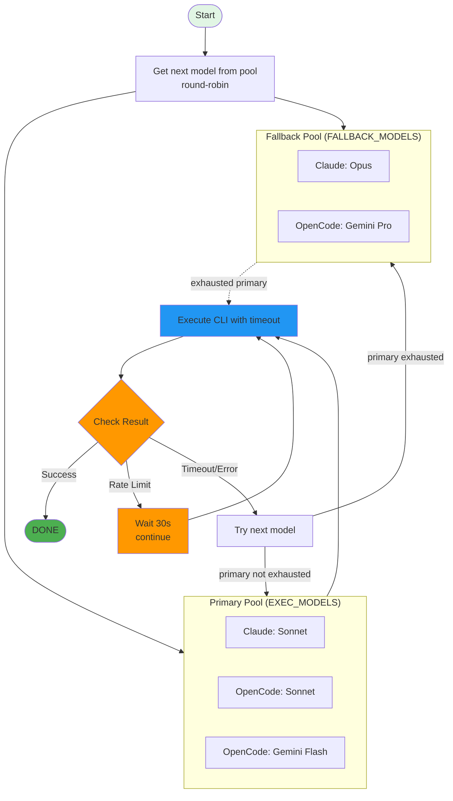

## Monorepo Structure

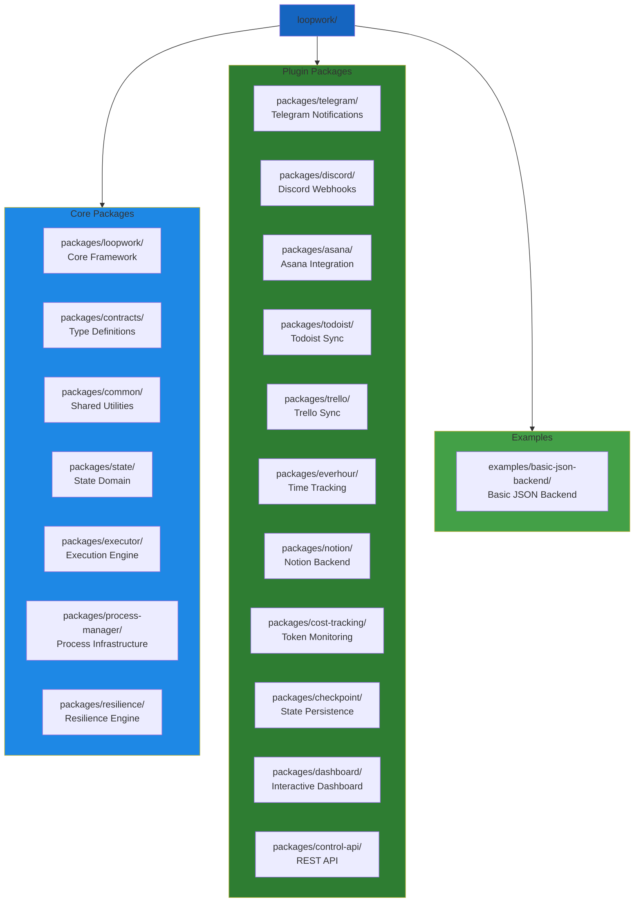

## Configuration System

```mermaid
flowchart LR
    ConfigFile[loopwork.config.ts<br/>TypeScript Config]

    ConfigFile --> DefineConfig[defineConfig()<br/>Type Safety + Defaults]
    DefineConfig --> Compose[compose()<br/>Chain Wrappers]
    Compose --> Plugins[withPlugin()<br/>withJSONBackend()<br/>etc.]
    Plugins --> FinalConfig[Final LoopworkConfig Object]

    style ConfigFile fill:#e1f5e4
    style FinalConfig fill:#4caf50
```

## Config Hot Reload

```mermaid
flowchart TD
    Start[getConfig() called<br/>hotReload=true]

    Start --> Manager[ConfigHotReloadManager<br/>.start()]

    Manager --> Watch[chokidar.watch()<br/>File Watcher Active]

    Watch -->|Config Modified| Detect[Watcher detects change]

    Detect --> Reload[reloadConfig()<br/>1. Clear Cache<br/>2. Re-import Module<br/>3. Validate Config]

    Reload --> Validate{Validate?}

    Validate -->|Valid| Update[Update currentConfig<br/>emit 'config-reloaded' event]
    Validate -->|Invalid| Error[Keep old config<br/>Log error]

    Update --> Listen[Listeners receive<br/>config-reloaded event]
    Error --> Watch

    style Start fill:#e1f5e4
    style Update fill:#4caf50
    style Error fill:#f44336
    style Validate fill:#ff9800
```

## Plugin System

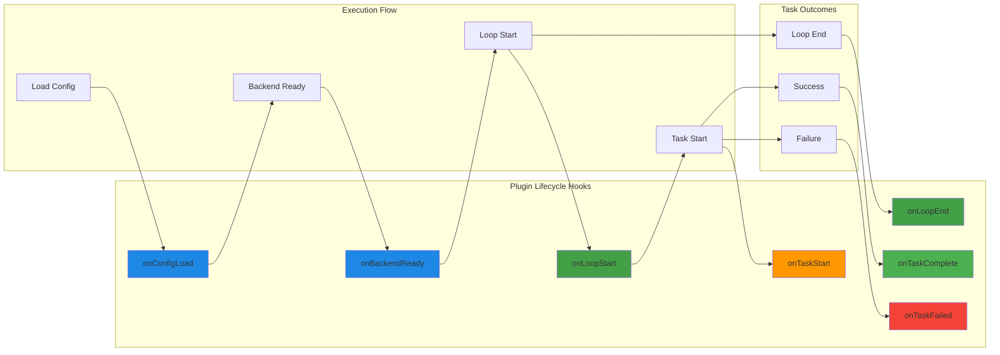

## Backend System

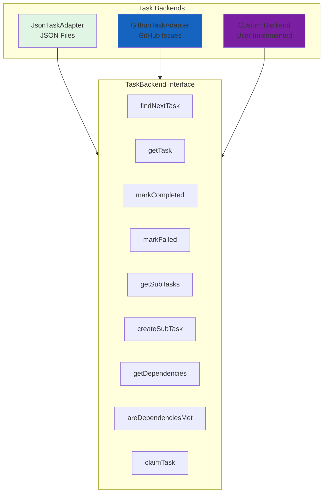

## Task Execution Flow

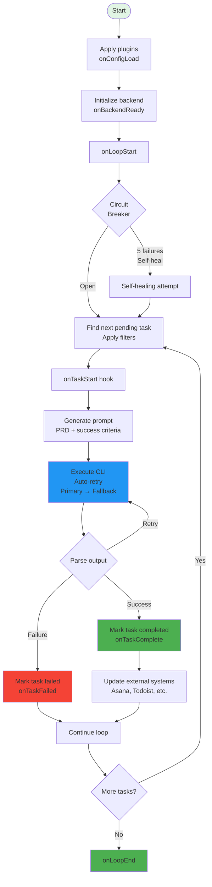

## State Management

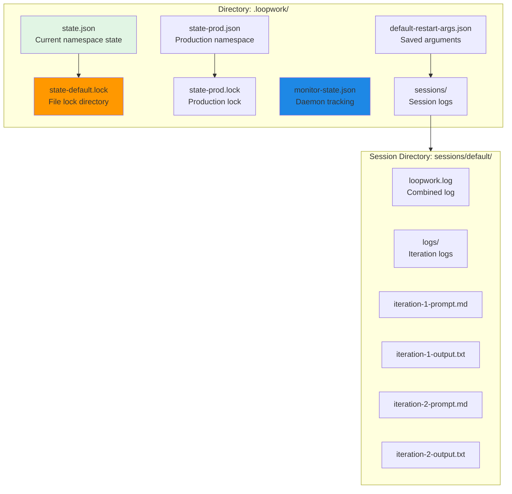

## Process Management

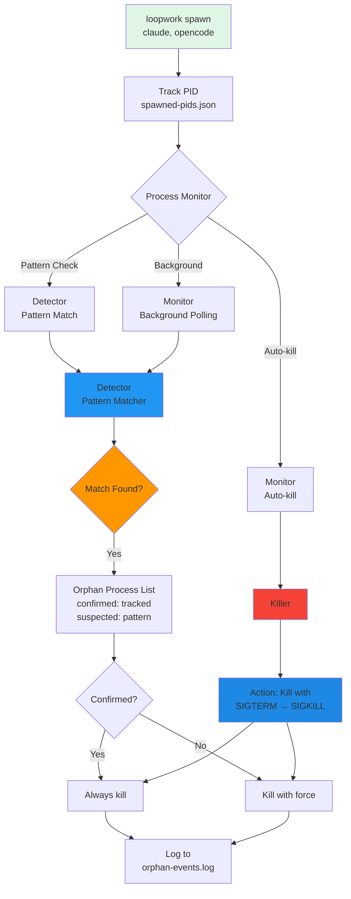

## Orphan Detection

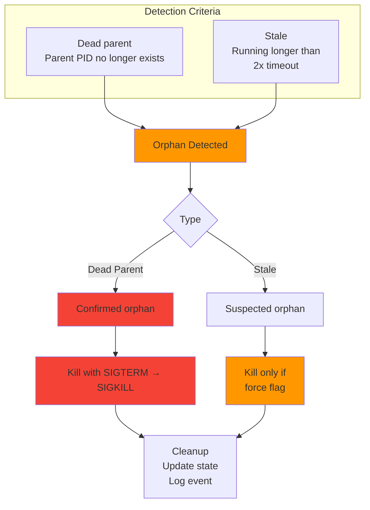

## AI Monitor & Self-Healing

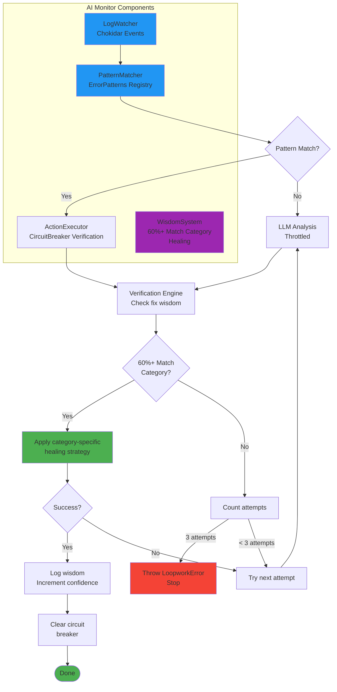

## Claude Plugin Architecture

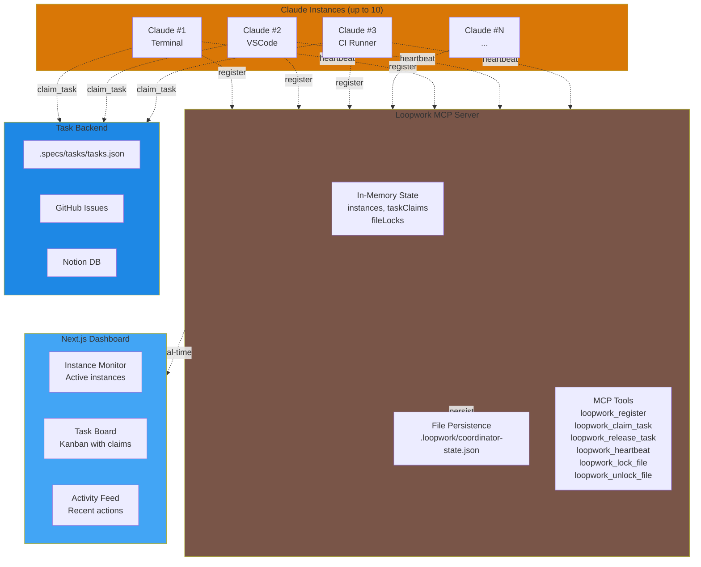

## Resource Pool Management

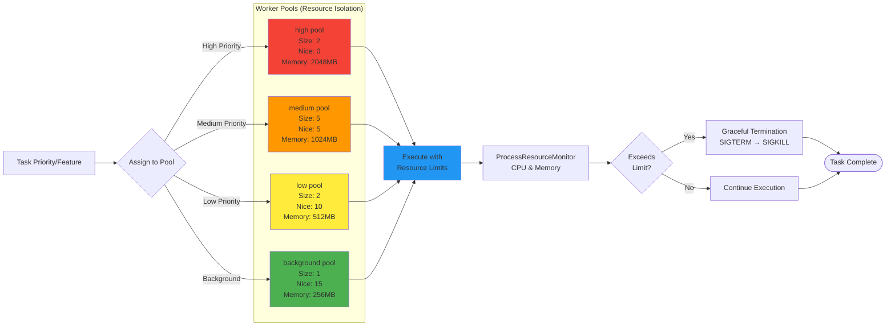

## Output System Architecture

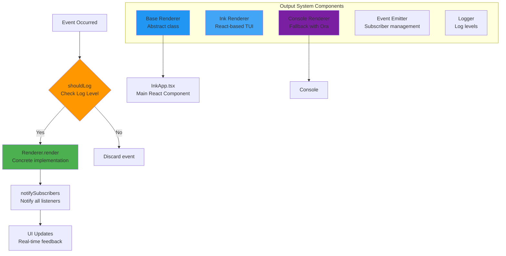

## File Locking Pattern

```mermaid
sequenceDiagram
    participant Process1 as Process 1
    participant Process2 as Process 2
    participant LockFile as Lock File
    participant TasksFile as tasks.json

    Process1->>LockFile: Acquire lock<br/>(write PID)
    LockFile-->>Process1: Lock granted
    Process1->>TasksFile: Read tasks
    Process1->>TasksFile: Mark task in-progress<br/>(atomic write)
    Process1-->>LockFile: Release lock

    Note over Process1,LockFile: Lock file contains PID<br/>Stale locks (>30s) are removed

    Process1->>LockFile: Acquire lock
    LockFile-->>Process1: Lock granted

    Process2->>LockFile: Acquire lock
    Note over Process2,LockFile: Blocked until Process 1 releases
    LockFile--xProcess2: Lock denied (stale detection)

    Process1->>TasksFile: Mark task completed
    Process1-->>LockFile: Release lock

    LockFile-->>Process2: Now available<br/>(retry succeeds)

    Note over Process2,LockFile: 100ms retry interval<br/>5s timeout

## Parallel Execution Architecture

```mermaid
flowchart TD
    Start([Start Parallel Run]) --> Config{Config<br/>workers=N}
    Config --> Pool[Worker Pool<br/>(Promise.allSettled)]

    subgraph WorkerLoop ["Worker Loop (xN)"]
        Find[backend.claimTask()] --> Claimed{Task Found?}
        Claimed -->|No| Wait[Wait taskDelay]
        Claimed -->|Yes| Execute[cliExecutor.executeTask()]

        Execute --> Result{Exit Code}
        Result -->|0| Success[backend.markCompleted()]
        Result -->|!=0| Failure[backend.markFailed()]

        Success --> Report[Update Stats]
        Failure --> Report
        Report --> CheckLimit{Max Iterations?}
        CheckLimit -->|No| Find
        CheckLimit -->|Yes| StopWorker([Stop Worker])
    end

    Pool --> WorkerLoop
    WorkerLoop --> Done([All Workers Done])

    subgraph Resilience ["Resilience Layer"]
        Circuit[Circuit Breaker]
        Healing[Self-Healing]
        Checkpoint[CheckpointIntegrator]
    end

    Failure --> Circuit
    Circuit -->|Threshold met| Healing
    Report --> Checkpoint
```

