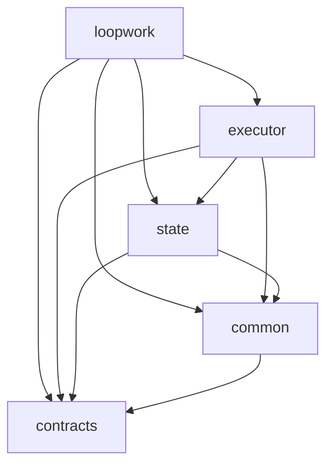

# Architecture Documentation

## Dependency Layering

To ensure maintainability and avoid circular dependencies, the Loopwork monorepo follows a strict layering approach:

1. **contracts**: Core interfaces, types, and constants. No internal dependencies.
2. **common**: Shared utilities, logger, and helpers. Depends on `contracts`.
3. **state**: State management, session persistence, and file locking. Depends on `contracts` and `common`.
4. **registry**: (Currently part of other packages or being extracted) Service and capability registries.
5. **executor**: CLI execution model, model selection, and process isolation. Depends on `contracts`, `common`, and `state`.
6. **loopwork**: Core framework, CLI runner, and plugin system. Depends on all layers above.

### Dependency Graph

The following diagram illustrates the dependency flow (arrows point to dependencies):



## Circular Dependency Prevention

We use `madge` to verify that no circular dependencies exist in the codebase. Circular dependencies are particularly problematic in Bun as they can lead to runtime crashes or unexpected module initialization behavior.

### Running the Check

You can run the circular dependency check using:

```bash
bun run check:circular
```

### Fixing Cycles

If a circular dependency is reported:
- **Move shared types**: Extract common types to the `contracts` package.
- **Separate interfaces**: Extract circular imports into a separate interface file in `contracts`.
- **Dynamic imports**: Use `await import()` for runtime-only dependencies that would otherwise cause a cycle.
